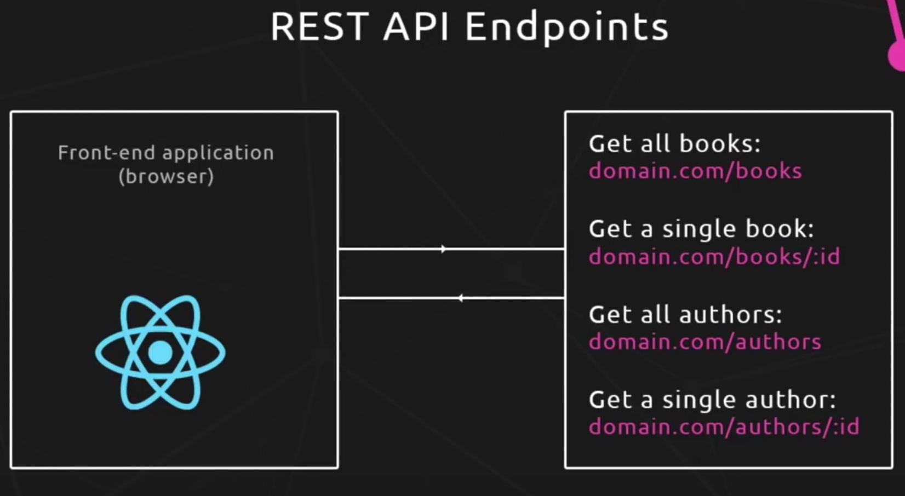

# GraphQL Practice - Novice to Expert

## Brief Summary

- Server
  - DB
    - mLab
  - GraphQL
  - Express
- FrontEnd
  - React
    - create-react-app
  - Apolo

## 1


## 2




## 3


## 4


---

# Backend

## 5, 6

```
npm i express
graphql (JS implementation of graphql)
express-graphql (for express)

npm i nodemon -D
```

## 7, 8 Schema

```js
const graphql = require('graphql')

const { GraphQLObjectType, GraphQLString } = graphql

const BookType = new GraphQLObjectType({
  name: 'Book',
  fields: () => ({
    id: { type: GraphQLString },
    name: { type: GraphQLString },
    genre: { type: GraphQLString }
  })
})
```

```js
const graphql = require('graphql')
const _ = require('lodash')

const { GraphQLObjectType, GraphQLString, GraphQLSchema } = graphql

var books = [
  {
    name: 'The Long Earth',
    genre: 'Sci-Fi',
    id: '3'
  },
  {
    name: 'The Long Earth222',
    genre: 'Sci-Fi',
    id: '2'
  }
]

const BookType = new GraphQLObjectType({
  name: 'Book',
  fields: () => ({
    id: { type: GraphQLString },
    name: { type: GraphQLString },
    genre: { type: GraphQLString }
  })
})

const RootQuery = new GraphQLObjectType({
  name: 'RootQueryType',
  fields: {
    book: {
      type: BookType,
      args: { id: { type: GraphQLString } },
      resolve(parent, args) {
        // code to get data from db / other source

        // Lodash:: find array of books that have an {id: args.id}
        return _.find(books, { id: args.id })
      }
    }
  }
})

// book(id: '2') {
//   name
//   genre
// }

module.exports = new GraphQLSchema({
  query: RootQuery // which queries allowing user to use when they're making query on FrontEnd
})
```

## 9, 10, 11

```js
const express = require('express')
const graphqlHTTP = require('express-graphql')
const schema = require('./schema/schema')

const app = express()

app.use(
  '/graphql',
  graphqlHTTP({
    schema,
    graphiql: true
  })
)

app.listen(4000, () => console.log('Server is running on port 4000'))
```

After we set this `graphiql: true`, we can now use this GUI functionality on our endpoint(`/graphql`).


```js
const RootQuery = new GraphQLObjectType({
  name: 'RootQueryType',
  fields: {
    book: {
      type: BookType,
      args: { id: { type: GraphQLID } }, // (string || int) => string by GraphQLID
      resolve(parent, args) {
        console.log(typeof args.id) // string
        return _.find(books, { id: args.id })
      }
    }
  }
})
```

## 12, 13

```js
const BookType = new GraphQLObjectType({
  name: 'Book',
  fields: () => ({
    id: { type: GraphQLID },
    name: { type: GraphQLString },
    genre: { type: GraphQLString },
    author: {
      type: AuthorType,
      resolve(parent, args) {
        console.log(parent)
        // parent = { name: 'The Long Earth222',
        //            genre: 'Sci-Fi',
        //            id: '2',
        //            authorId: '2' }

        return _.find(authors, { id: parent.authorId })
      }
    }
  })
})
```

Query

```graphql
{
  book(id: 2) {
    name
    genre
    id
    author {
      name
      age
      id
    }
  }
}
```

## 14

```js
const BookType = new GraphQLObjectType({
  // ...
})
const AuthorType = new GraphQLObjectType({
  name: 'Author',
  fields: () => ({
    id: { type: GraphQLID },
    name: { type: GraphQLString },
    age: { type: GraphQLInt },
    books: {
      type: new GraphQLList(BookType),
      resolve(parent, args) {
        return _.filter(books, { authorId: parent.id })
      }
    }
  })
})
```

- `GraphQLList`
- `parent`
- `filter`
- `fields`에서 함수로 감싸서 호출하는 이유는, 여러 타입들을 참조하게 될경우 나중에 정의된 타입을 앞에서 불러읽을 수 없는 문제가 발생하기 때문이다. 따라서 **closure**를 이용해주었다 !

## 15

```js
const RootQuery = new GraphQLObjectType({
  name: 'RootQueryType',
  fields: {
    book: {
      type: BookType,
      args: { id: { type: GraphQLID } }, // (string || int) => string by GraphQLID
      resolve(parent, args) {
        return _.find(books, { id: args.id })
      }
    },
    author: {
      type: AuthorType,
      args: { id: { type: GraphQLID } },
      resolve(parent, args) {
        return _.find(authors, { id: args.id })
      }
    },
    books: {
      type: new GraphQLList(BookType),
      resolve(parent, args) {
        return books
      }
    },
    authors: {
      type: new GraphQLList(AuthorType),
      resolve(parent, args) {
        return authors
      }
    }
  }
})
```

- `book`, `author` 에 이어서 복수항들을 얻어오는 `field`를 작성
- `GraphQLList(Type)`

## 16

- https://mlab.com
- Create Database
  - **Must register the database user on the site**
  - mongodb://<dbuser>:<dbpassword>@fk181818.mlab.com:777/himitsu
- install
- `npm i mongoose dotenv`

  ```js
  //...
  const mongoose = require('mongoose')
  const dotenv = require('dotenv')

  const app = express()

  dotenv.config()
  mongoose.connect(
    process.env.DB_URL,
    { useNewUrlParser: true }
  )
  mongoose.connection.once('open', () => {
    console.log('Connected to database')
  })
  //...
  ```

## 17

```js
const mongoose = require('mongoose')
const Schema = mongoose.Schema

const bookSchema = new Schema({
  // id will be created automatically
  name: String,
  genre: String,
  author: String
})

module.exports = mongoose.model('Book', bookSchema)
```

# 18, 19 Mutation

```js
const Mutation = new GraphQLObjectType({
  name: 'Mutation',
  fields: {
    addAuthor: {
      type: AuthorType,
      args: {
        name: { type: GraphQLString },
        age: { type: GraphQLInt }
      },
      resolve(parent, args) {
        let author = new Author({
          name: args.name,
          age: args.age
        })
        return author.save()
      }
    },
    addBook: {
      type: BookType,
      args: {
        name: { type: GraphQLString },
        genre: { type: GraphQLString },
        authorId: { type: GraphQLID }
      },
      resolve(parent, args) {
        let book = new Book({
          name: args.name,
          genre: args.genre,
          authorId: args.authorId
        })
        return book.save()
      }
    }
  }
})

module.exports = new GraphQLSchema({
  query: RootQuery, // which queries allowing user to use when they're making query on FrontEnd
  mutation: Mutation
})
```

```graphql
mutation {
  addAuthor(name: "Steven", age: 39) {
    name
    age
  }
}

#

mutation {
  addBook(
    name: "The Long Earth"
    genre: "Sci-Fi"
    authorId: "5ba449b2c6c17c21ed95e932"
  ) {
    name
    genre
  }
}
```

## 20

```js
//...
const BookType = new GraphQLObjectType({
  name: 'Book',
  fields: () => ({
    id: { type: GraphQLID },
    name: { type: GraphQLString },
    genre: { type: GraphQLString },
    author: {
      type: AuthorType,
      resolve(parent, args) {
        // return _.find(authors, { id: parent.authorId })
        return Author.findById(parent.authorId)
      }
    }
  })
})

const AuthorType = new GraphQLObjectType({
  name: 'Author',
  fields: () => ({
    id: { type: GraphQLID },
    name: { type: GraphQLString },
    age: { type: GraphQLInt },
    books: {
      type: new GraphQLList(BookType),
      resolve(parent, args) {
        // return _.filter(books, { authorId: parent.id })
        return Book.find({ authorId: parent.id })
      }
    }
  })
})

const RootQuery = new GraphQLObjectType({
  name: 'RootQueryType',
  fields: {
    book: {
      type: BookType,
      args: { id: { type: GraphQLID } }, // (string || int) => string by GraphQLID
      resolve(parent, args) {
        // return _.find(books, { id: args.id })
        return Book.findById(args.id)
      }
    },
    author: {
      type: AuthorType,
      args: { id: { type: GraphQLID } },
      resolve(parent, args) {
        // return _.find(authors, { id: args.id })
        return Author.findById(args.id)
      }
    },
    books: {
      type: new GraphQLList(BookType),
      resolve(parent, args) {
        // return books
        return Book.find({})
      }
    },
    authors: {
      type: new GraphQLList(AuthorType),
      resolve(parent, args) {
        // return authors
        return Author.find({})
      }
    }
  }
})

const Mutation = new GraphQLObjectType({
  name: 'Mutation',
  fields: {
    addAuthor: {
      type: AuthorType,
      args: {
        name: { type: GraphQLString },
        age: { type: GraphQLInt }
      },
      resolve(parent, args) {
        let author = new Author({
          name: args.name,
          age: args.age
        })
        return author.save()
      }
    },
    addBook: {
      type: BookType,
      args: {
        name: { type: GraphQLString },
        genre: { type: GraphQLString },
        authorId: { type: GraphQLID }
      },
      resolve(parent, args) {
        let book = new Book({
          name: args.name,
          genre: args.genre,
          authorId: args.authorId
        })
        return book.save()
      }
    }
  }
})

module.exports = new GraphQLSchema({
  query: RootQuery, // which queries allowing user to use when they're making query on FrontEnd
  mutation: Mutation
})
```

```graphql
{
  authors {
    name
    age
    books {
      name
      genre
    }
  }
}

{
  book(id: "5ba44ca46354e122f4d7cd84") {
    name
    genre
    author {
      name
      books {
        name
      }
    }
  }
}
```

## 21

```js
const Mutation = new GraphQLObjectType({
  name: 'Mutation',
  fields: {
    addAuthor: {
      type: AuthorType,
      args: {
        name: { type: new GraphQLNonNull(GraphQLString) },
        age: { type: new GraphQLNonNull(GraphQLInt) }
      },
      resolve(parent, args) {
        let author = new Author({
          name: args.name,
          age: args.age
        })
        return author.save()
      }
    },
    addBook: {
      type: BookType,
      args: {
        name: { type: new GraphQLNonNull(GraphQLString) },
        genre: { type: new GraphQLNonNull(GraphQLString) },
        authorId: { type: new GraphQLNonNull(GraphQLID) }
      },
      resolve(parent, args) {
        let book = new Book({
          name: args.name,
          genre: args.genre,
          authorId: args.authorId
        })
        return book.save()
      }
    }
  }
})
```

- `GraphQLNonNull` 을 추가해줘서 기본적인 validation 을 추가해줄 수 있다.

---

# FrontEnd

## 22, 23


- Using GraphQL Client ( Apollo )


- create-react-app
- In order to work with GraphQL on the FrontEnd, be able to make queries to server, we need to use **GraphQL Client**, **Apollo**.
  - RestAPI : `jquery` or `axios`
  - GraphQL : `apollo client`(Graphql Client)
  - `npm install apollo-boost react-apollo graphql --save`
  - https://www.apollographql.com/docs/react/essentials/get-started.html

```js
import React, { Component } from 'react'
import ApolloClient from 'apollo-boost'
import { ApolloProvider } from 'react-apollo'

// components
import BookList from './components/BookList'

// apollo client setup
const client = new ApolloClient({
  uri: 'http://localhost:4000/graphql'
})

class App extends Component {
  render() {
    return (
      <ApolloProvider client={client}>
        <div className="main">
          <h1>Ninja's Reading List</h1>
          <BookList />
        </div>
      </ApolloProvider>
    )
  }
}

export default App
```

- 미들웨어처럼 저렇게 감싸서 유저와 서버간의 graphql Read / Create 를 도와준다.

## 24, 25, 26

```js
import React, { Component } from 'react'
import { gql } from 'apollo-boost'
import { graphql } from 'react-apollo' // bind apollo with react

const getBooksQuery = gql`
  {
    books {
      name
      id
    }
  }
`

class BookList extends Component {
  state = {}
  render() {
    console.log(this.props)
    return (
      <div>
        <ul id="book-list">
          <li>Book name</li>
        </ul>
      </div>
    )
  }
}

export default graphql(getBooksQuery)(BookList) // bind this GraphQL query to this Component(BookList)
```

- **gql query 생성에 주의**
- **react-apollo.graphql 로 바인딩해주는것 주의**
  
- BookList Component 에서의 `this.props`는 위처럼 나타난다.
  - 여기서 `data`는 graphql 서버로부터 받은 결과값임.
  - 위의 `loading: true` -> `loading: false`로 바뀌는 것에서
    - graphql 서버의 데이터가 전송 완료 유/무를 판단가능
    - 전송 완료시 **rerendering**이 일어남.

## 27

```js
class BookList extends Component {
  displayBooks() {
    var data = this.props.data
    if (data.loading) {
      return <div>Loading books from server...</div>
    }
    return data.books.map(book => <li key={book.id}>{book.name}</li>)
  }
  render() {
    return (
      <div>
        <ul id="book-list">{this.displayBooks()}</ul>
      </div>
    )
  }
}

export default graphql(getBooksQuery)(BookList) // bind this GraphQL query to this Component(BookList)
```

- displayBooks()

## 28

```js
submitForm(e) {
    e.preventDefault()
    console.log(this.state)
  }

render() {
  return (
    // bind submitForm to Component
    <form id="add-book" onSubmit={this.submitForm.bind(this)}>
      <div className="field">
        <label>Book name:</label>
        <input
          type="text"
          onChange={e => this.setState({ name: e.target.value })}
        />
      </div>
      <div className="field">
        <label>Genre:</label>
        <input
          type="text"
          onChange={e => this.setState({ genre: e.target.value })}
        />
      </div>
      <div className="field">
        <label>Author:</label>
        <select onChange={e => this.setState({ authorId: e.target.value })}>
          <option>Select author</option>
          {this.displayAuthors()}
        </select>
      </div>
      <button>+</button>
    </form>
  )
}
```

- add event

## 29

```js
// queries.js
const addBookMutation = gql`
  mutation {
    addBook(name: "", genre: "", authorId: "") {
      name
      id
    }
  }
`
```

```js
  displayAuthors() {
    var data = this.props.getAuthorsQuery
    console.log(this.props)
    if (data.loading) {
      return <option disabled>Loading Authors...</option>
    }
    return data.authors.map(author => (
      <option key={author.id} value={author.id}>
        {author.name}
      </option>
    ))
  }

export default compose(
  graphql(getAuthorsQuery, { name: 'getAuthorsQuery' }),
  graphql(addBookMutation, { name: 'addBookMutation' })
)(AddBook)
```


## 32

```js
  submitForm(e) {
    e.preventDefault()
    this.props.addBookMutation({
      variables: {
        name: this.state.name,
        genre: this.state.genre,
        authorId: this.state.authorId
      }
    })
  }
```

```js
const addBookMutation = gql`
  mutation($name: String!, $genre: String!, $authorId: ID!) {
    addBook(name: $name, genre: $genre, authorId: $authorId) {
      name
      id
    }
  }
`
```

- add variables dynamically and send to server.

## 33

```js
  submitForm(e) {
    e.preventDefault()
    this.props.addBookMutation({
      variables: {
        name: this.state.name,
        genre: this.state.genre,
        authorId: this.state.authorId
      },
      refetchQueries: [{ query: getBooksQuery }]
    })
  }
```

- `refetchQueries`를 지정함으로서, 다시 책 목록이 갱신되게 할 수 있다.

## 34

```js
import React, { Component } from 'react'
import { graphql } from 'react-apollo' // bind apollo with react
import { getBookQuery } from '../queries/queries'

class BookDetails extends Component {
  render() {
    return (
      <div id="book-details">
        <p>Output book details here</p>
      </div>
    )
  }
}

export default graphql(getBookQuery)(BookDetails)
```

```js
class BookList extends Component {
  displayBooks() {
    var data = this.props.data
    if (data.loading) {
      return <div>Loading books from server...</div>
    }
    return data.books.map(book => <li key={book.id}>{book.name}</li>)
  }
  render() {
    return (
      <div>
        <ul id="book-list">{this.displayBooks()}</ul>
        <BookDetails />
      </div>
    )
  }
}
```

##
